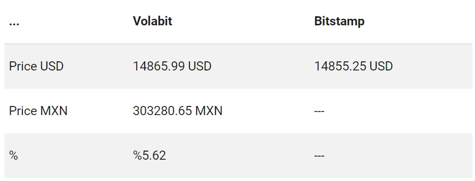

# Mifiel

### Prueba Técnica 

Consumir las API´s de Volabit, Bitso y Bitsamp y calcular el porcentaje de diferencia. Para mas detalles, adjunto la prueba [aquí](https://github.com/Mifiel/fun-tests/tree/master/full-stack/ror/opportunity-detector)

### Logros :smile:

Consumi las Apis, calcule el porcentaje y hago el efecto de que se actualizen los datos. 

### Retos :sunglasses:

* No pude consumir la Api de Bitso, me generaba un error, buscando y leyendo aprendí que ese error salia por los CORS, mas detalle [aquí](https://stackoverflow.com/questions/43292481/getting-the-response-as-datanull-status-1-when-calling-web-api-from-angula), por consecuencia me llevo tiempo y lo mismo pasaba con la Api de Bitstamp.

* Las Apis que me dierón en un principio, manda bastante información y eso ocasiono confusión en mí :frowning:

* La tablita del Ejemplo, me comento Genaro que no esta bien el orden, porque yo pensaba que tenia que consumir los precios MXN, pero al final las API´s solo mostraban USD, y eso tambíen me confundio, pero una vez preguntando, logre entender mejor.

* Use angularjs, aunque ya había trabajado con este framework me llevo tiempo recordar como consumir servicios, pero me satisface haberlo logrado.

* Me causo mucho conflicto con los porcentajes, no entendi con claridad como se obtenian, y estuve apoyandome de Genaro, yo habia encontrado una [solución para las diferencias de porcentajes](http://www.disfrutalasmatematicas.com/numeros/porcentaje-diferencia.html), pero no comprendia que datos debia usar puntualmente. Y eso me llevo tiempo. 

### Lo último
> Agradezco el apoyo que recibí y aunque demore en la solución quedo satisfecha por el resultado, considerando que hay mejoras por hacer. :bowtie:

### Stack: 
1. HTML5
2. Framework de css materialize
3. Angularjs 
4. Javascript 

